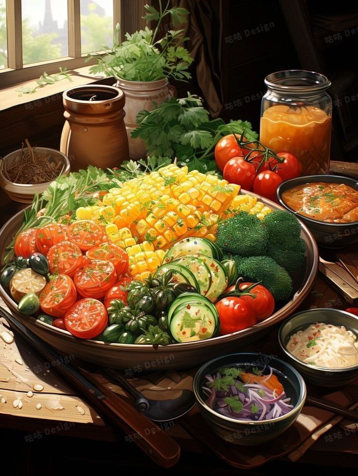

# 🍎 BiteTrack - Smart Nutrition Tracker

 
**BiteTrack** is a comprehensive web-based nutrition and fitness tracking application designed to help users monitor their daily caloric intake, track macronutrients, log water consumption, and stay connected with a fitness community.

Built with **PHP** and **MySQL**, it features a modern, responsive interface powered by **Tailwind CSS** and interactive data visualization using **ApexCharts**.

---

## ✨ Key Features

### 📊 Interactive Dashboard
- **Visual Analytics:** View real-time charts for daily calorie, protein, and carb intake.
- **Daily & Weekly Stats:** Compare your current intake against your weekly averages.
- **Hydration Tracker:** Log water intake with a single click and track progress towards your daily goal.

### 🥗 Smart Meal Logging
- **Automated Nutrition Data:** Integrated with the **CalorieNinjas API** to automatically fetch calories, protein, and carbs for food items (e.g., type "1 apple" to get stats).
- **Meal History:** View logs for "Today" or "This Week" with pagination and search functionality.

### 🎯 Goal Setting & Profile
- **Personalized Targets:** Set daily goals for Calories, Protein, and Carbohydrates.
- **Body Metrics:** Track weight, height, and age to monitor physical progress.
- **Progress Bars:** Visual indicators showing how close you are to hitting your daily limits.

### 🌏 Community Feed (SNS)
- **Social Sharing:** Post updates about your fitness journey.
- **Global Feed:** See posts from other users in the BiteTrack community.
- **Modern UI:** Clean, social-media style layout with user avatars and timestamps.

---

## 🛠️ Tech Stack

- **Frontend:** - HTML5, JavaScript (ES6+)
  - [Tailwind CSS](https://tailwindcss.com/) (Styling)
  - [ApexCharts.js](https://apexcharts.com/) (Data Visualization)
  - [Flowbite](https://flowbite.com/) (UI Components)
  - FontAwesome (Icons)
- **Backend:** - PHP (Native)
- **Database:** - MySQL / MariaDB
- **APIs:** - [CalorieNinjas API](https://calorieninjas.com/) (Food Nutrition Data)

---

## 🚀 Installation & Setup

Follow these steps to run BiteTrack on your local machine using **XAMPP** (or WAMP/MAMP).

### 1. Clone the Repository
```bash
git clone [https://github.com/yourusername/BiteTrack.git](https://github.com/yourusername/BiteTrack.git)
 
